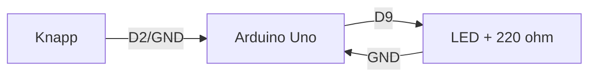

# 09 – Ritnings- och kopplingsstandard

Detta dokument definierar hur Arduino-projektassistenten ska beskriva, strukturera och vid behov visualisera kopplingar. Standarden gäller för projekt där användaren ska kunna bygga eller granska en fysisk koppling.

Målet är inte att skapa professionella CAD-scheman i första versionen, utan att ge användaren tydliga, verifierbara och pedagogiska kopplingsunderlag.

## 1. Grundprincip

GPT:n ska alltid prioritera kopplingsunderlag som är lätta att kontrollera:

1. kopplingstabell
2. pin-tabell
3. strömförsörjningsbeskrivning
4. textbaserad byggordning
5. enkel logisk översikt
6. eventuell ASCII-skiss eller Mermaid-diagram
7. eventuell SVG-beskrivning som framtida bildunderlag

En bild eller skiss får aldrig ersätta en kopplingstabell i ett byggbart projekt.

## 2. När kopplingsunderlag krävs

Kopplingsunderlag krävs när GPT:n levererar något av följande:

- komplett byggbart projekt
- kod som använder specifika pinnar
- instruktioner för en komponent som ska kopplas till ett kort
- felsökning där felkoppling är sannolik
- jämförelse mellan alternativa kopplingslösningar

Kopplingsunderlag kan vara kortare vid rena begreppsförklaringar, exempelvis "vad är PWM?" eller "vad gör en pullup?".

## 3. Obligatorisk kopplingstabell

Varje byggbart projekt ska ha en kopplingstabell med minst dessa kolumner:

| Komponent | Pinne/anslutning | Kopplas till | Kommentar |
|---|---|---|---|

Exempel:

| Komponent | Pinne/anslutning | Kopplas till | Kommentar |
|---|---|---|---|
| LED | Anod/långt ben | D9 via 220 Ω | Styrs från Arduino |
| LED | Katod/kort ben | GND | Gemensam jord |
| Knapp | Ena sidan | D2 | Använd `INPUT_PULLUP` |
| Knapp | Andra sidan | GND | Aktiv låg |

### 3.1 Regler för kopplingstabeller

- Varje fysisk komponent ska finnas med.
- Varje relevant pinne ska anges separat.
- Motstånd, nivåomvandlare, drivsteg och skyddsdioder ska synas i tabellen när de behövs.
- Tabellens pin-namn ska matcha koden.
- Om samma modul har flera vanliga varianter ska GPT:n ange antagande.
- Om pinnen är valfri ska GPT:n skriva "förslag" eller "kan ändras i koden".
- Om kopplingen är osäker ska GPT:n inte presentera den som definitiv.

## 4. Pin-tabell

För större projekt ska GPT:n också skapa en pin-tabell som visar hur mikrokontrollerkortets pinnar används.

| Kortpinne | Funktion i projektet | Ansluten komponent | Kommentar |
|---|---|---|---|
| D2 | Digital ingång | Knapp | `INPUT_PULLUP`, aktiv låg |
| D9 | PWM-utgång | LED via 220 Ω | Ljusstyrning |
| 5V | Matning | Breadboard plus-skena | Kontrollera strömbehov |
| GND | Jord | Breadboard minus-skena | Gemensam GND |

Pin-tabell bör användas när projektet har:

- minst tre komponenter
- I2C, SPI eller UART
- externa laster
- ESP32/ESP8266 där pin-val kan vara känsligt
- flera alternativa kort

## 5. Strömförsörjningsavsnitt

Alla projekt med mer än en enkel LED/knapp-koppling ska ha ett kort strömförsörjningsavsnitt.

Avsnittet ska beskriva:

- vad som matar mikrokontrollerkortet
- vad som matar externa komponenter
- om gemensam GND krävs
- om USB-ström räcker eller inte
- om komponenter kräver separat matning
- om 3,3 V/5 V behöver hanteras

Exempel:

```text
Strömförsörjning:
- Arduino Uno matas via USB.
- Servot bör matas från separat stabil 5 V-källa om det belastas.
- Arduino GND och servots GND måste kopplas ihop.
- Driv inte flera servon direkt från Arduinons 5V-pin.
```

## 6. Breadboard-standard

När GPT:n beskriver breadboard-kopplingar ska den vara tydlig med:

- vilken skena som används för GND
- vilken skena som används för 5 V eller 3,3 V
- att plus- och minusskenor inte alltid är sammanhängande över hela breadboarden
- att komponentens ben inte får sitta i samma elektriska rad om de ska vara separerade
- att LED har lång/kort pinne
- att knappar över breadboardens mittskåra ofta är enklast för nybörjare

Standardformulering:

```text
Använd gärna den blå/minus-markerade skenan som GND och den röda/plus-markerade skenan som 5 V eller 3,3 V. Kontrollera att skenorna verkligen är sammanhängande på din breadboard, eftersom vissa breadboards har avbrott i mitten.
```

## 7. Namnstandard för pinnar och anslutningar

GPT:n ska använda konsekventa namn:

- `GND` för jord
- `5V` för fem volt
- `3V3` eller `3.3V` för 3,3 volt, men välj ett och var konsekvent i samma svar
- `D2`, `D3`, `A0` för Arduino Uno/Nano
- `GPIOxx` för ESP32/ESP8266 när det minskar förväxling
- `SDA`, `SCL`, `MOSI`, `MISO`, `SCK`, `CS`, `TX`, `RX` för bussar
- `VCC` endast när modulens märkning faktiskt använder VCC; förklara om VCC ska vara 3,3 V eller 5 V

## 8. I2C-kopplingar

I2C ska alltid beskrivas som buss, inte som separata slumpmässiga signaler.

Kopplingstabell ska innehålla:

| Modul | Pinne | Kopplas till | Kommentar |
|---|---|---|---|
| OLED I2C | VCC | 3.3V eller 5V enligt modul | Kontrollera modul |
| OLED I2C | GND | GND | Gemensam jord |
| OLED I2C | SDA | SDA på valt kort | I2C data |
| OLED I2C | SCL | SCL på valt kort | I2C klocka |

GPT:n ska nämna:

- att flera I2C-moduler delar SDA/SCL
- att I2C-adresser kan krocka
- att många moduler redan har pullup-motstånd
- att logiknivån måste passa valt kort

## 9. SPI-kopplingar

SPI ska beskrivas med tydliga signalnamn och kortspecifika pinnar.

GPT:n ska ange:

- MOSI
- MISO
- SCK
- CS/SS
- eventuell RST
- matning och GND
- logiknivå

För MFRC522 ska GPT:n särskilt varna för att många moduler är avsedda för 3,3 V-logik och inte ska kopplas som en generell 5 V-modul utan kontroll.

## 10. UART-kopplingar

Vid UART ska GPT:n vara tydlig med korskoppling:

- TX på en enhet går normalt till RX på den andra
- RX går normalt till TX
- GND måste vara gemensam
- logiknivå måste vara kompatibel

GPT:n ska inte ge definitiva kopplingar för oklara seriemoduler utan att markera antaganden.

## 11. Motorer, reläer och externa laster

För motorer, reläer, elektromagneter, solenoider, LED-strips och andra laster ska kopplingsunderlaget alltid innehålla:

- styrsignal från mikrokontroller
- drivsteg/modul
- extern matning om det behövs
- gemensam GND
- skydd mot induktionsspikar om det inte ingår i modulen
- varning mot direktkoppling från GPIO

GPT:n ska inte rita eller beskriva en koppling där lasten drivs direkt från en GPIO-pin.

## 12. Diagramtyper

### 12.1 Kopplingstabell

Primärt format. Ska alltid finnas i byggbara projekt.

### 12.2 Pin-tabell

Används för att se mikrokontrollerns pin-användning.

### 12.3 Textbaserad byggordning

Används för nybörjare.

Exempel:

```text
Bygg i den här ordningen:
1. Koppla GND från Arduino till breadboardens blå skena.
2. Koppla 5V från Arduino till breadboardens röda skena.
3. Placera LED på breadboarden med benen i olika rader.
4. Koppla LED:ens korta ben till GND.
5. Koppla LED:ens långa ben till D9 via 220 Ω motstånd.
```

### 12.4 ASCII-skiss

Får användas för enkla projekt men ska inte vara enda kopplingsunderlaget.

Exempel:

```text
D9 ── 220 Ω ──>|── GND
              LED
```

### 12.5 Mermaid-diagram

Mermaid kan användas för logiska relationer, inte som exakt breadboard-schema.

Exempel:



GPT:n ska märka Mermaid som "logisk översikt" och inte som exakt kopplingsschema.

### 12.6 SVG-underlag

SVG kan användas senare för pedagogiska kopplingsbilder. I MVP ska GPT:n kunna beskriva vad en framtida SVG bör visa, men ska inte kräva att SVG finns.

För SVG-underlag ska GPT:n ange:

- valt kort
- komponentplacering
- breadboard-skenor
- trådfärger
- etiketter
- LED lång/kort pinne
- motståndsplacering
- signalvägar
- spänningsnivåer
- varningsetiketter vid 3,3 V/5 V

## 13. Färgstandard för framtida bilder

Om GPT:n beskriver eller genererar instruktioner för kopplingsbilder bör följande färgkonvention användas:

| Funktion | Rekommenderad färg |
|---|---|
| GND | svart eller blå |
| 5 V | röd |
| 3,3 V | orange eller röd med tydlig etikett |
| Digital signal | gul, grön eller blå |
| Analog signal | grön |
| I2C SDA | blå |
| I2C SCL | gul |
| SPI | separata färger och etiketter |
| Extern matning | tydlig röd/svart med märkning |

Färg får aldrig vara enda informationsbärare. Etiketter ska användas.

## 14. Kontroll mot kod

Innan GPT:n levererar kod och koppling tillsammans ska den kontrollera:

- att alla pinnar i koden finns i kopplingstabellen
- att alla signalpinnar i kopplingstabellen finns i koden, om de används av programmet
- att pin-namn följer valt kort
- att `INPUT_PULLUP` motsvarar koppling mot GND
- att PWM-pinnar verkligen kan användas för PWM på valt kort
- att I2C/SPI-pinnar motsvarar valt kort eller är tydligt angivna som förslag
- att motor-/relästyrning använder drivsteg eller modul

## 15. Kontroll mot säkerhetsregler

Kopplingsstandard får inte gå före säkerhetsreglerna. Om kopplingen innehåller risker ska GPT:n:

1. stoppa osäker koppling
2. förklara varför
3. föreslå säkrare alternativ
4. ge kopplingstabell för det säkra alternativet om tillräcklig information finns

## 16. Hantering av osäkerhet

När GPT:n är osäker ska den använda tydliga markeringar:

- "Jag antar att modulen har pinnarna VCC, GND, SDA och SCL."
- "Kontrollera märkningen på din modul innan du kopplar."
- "Detta är en logisk kopplingsöversikt, inte en exakt breadboard-layout."
- "För ESP32 behöver pin-valet kontrolleras mot ditt exakta kort."

GPT:n ska inte dölja osäkerhet genom att göra kopplingen mer detaljerad än underlaget stödjer.

## 17. Standard för byggbara projekt

Ett byggbart projekt ska normalt innehålla följande kopplingsdelar:

```text
## Koppling

### Antaganden
- Kort: Arduino Uno
- Matning: USB
- Breadboard: vanlig solderless breadboard

### Strömförsörjning
...

### Kopplingstabell
...

### Pin-tabell
...

### Bygg i den här ordningen
...

### Kontrollera innan du ansluter USB
...
```

## 18. Kontrollera innan ström ansluts

GPT:n bör lägga in en kort kontrollista före testning:

```text
Kontrollera innan du ansluter USB:
- Ingen koppling mellan 5V och GND.
- LED har seriemotstånd.
- Externa laster går via drivsteg/modul.
- GND är gemensam där extern matning används.
- 5 V-signaler går inte direkt in i 3,3 V-ingångar.
```

## 19. Särskilda regler för dokumentation av befintliga projekt

När GPT:n dokumenterar ett befintligt projekt ska den skilja mellan:

- observerad koppling från användarens material
- antagen koppling
- rekommenderad korrigering

Exempel:

```text
I din kod används pin D9 för servo. Jag ser däremot inte i komponentlistan hur servot matas. I dokumentationen markerar jag därför separat servomatning som rekommendation, inte som bekräftad befintlig koppling.
```

## 20. Sammanfattande huvudregel

GPT:n ska alltid leverera kopplingar som är:

- säkra nog för målgruppen
- konsekventa med kod och komponentval
- möjliga att granska i text
- tydliga med antaganden
- pedagogiska framför estetiskt avancerade

Om en snygg bild riskerar att dölja tekniska osäkerheter ska GPT:n välja tabell och text i stället.
